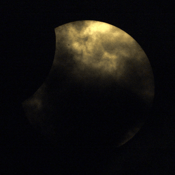
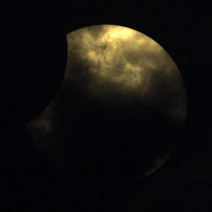
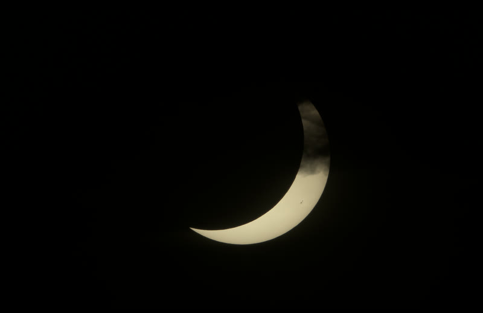
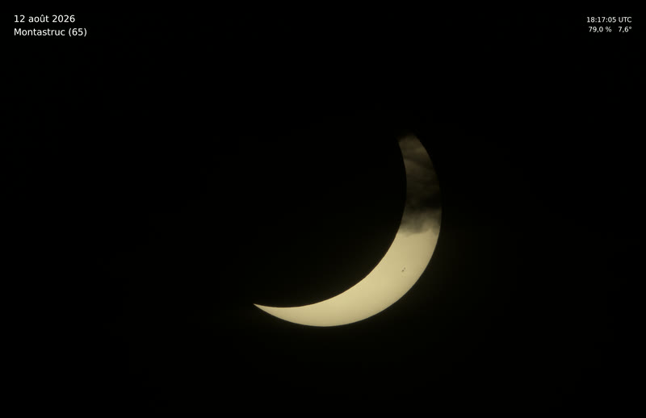
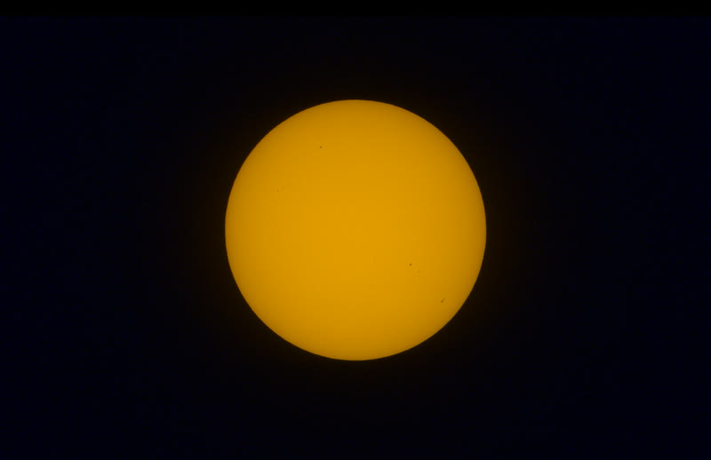
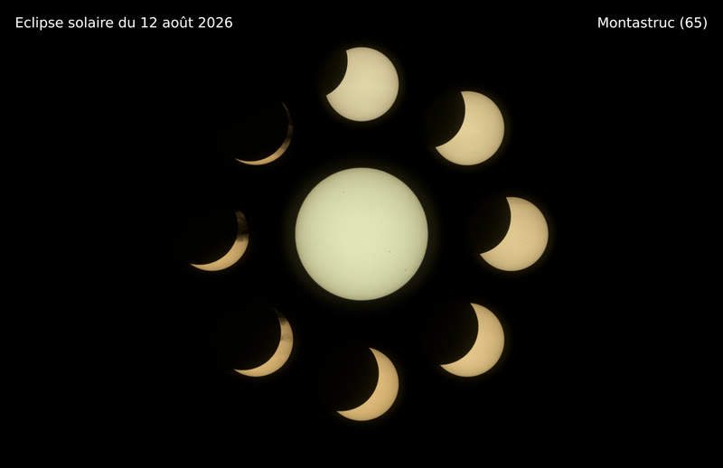
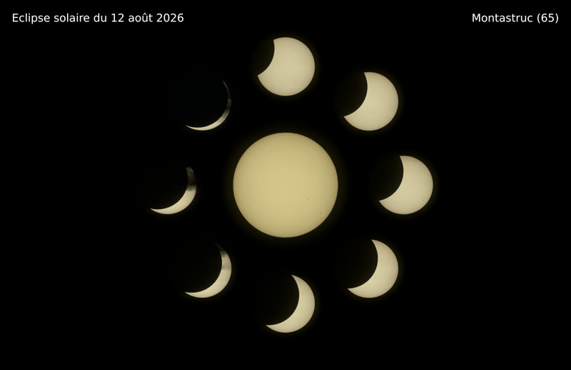
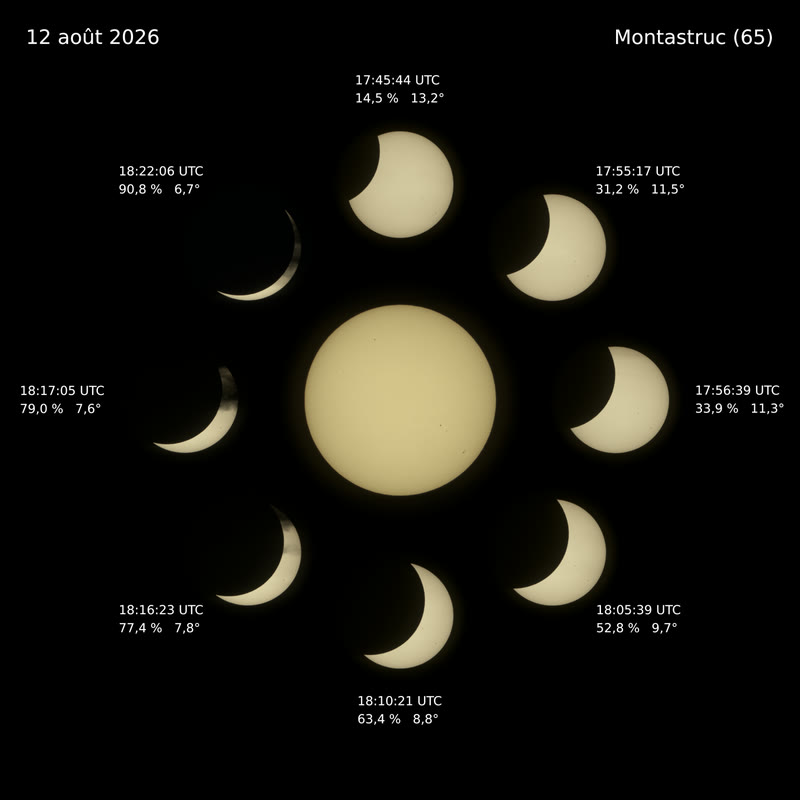

# Alignement, prétraitement et timelapse, éclipse partielle du 12 août 2026

Traitement d'une série de 1000+ FITS d'éclipse solaire partielle :
centrage sous-pixel à rayon figé, classement par phase, timelapse couleur,
tirages et compositions.

Vue observateur terrestre. Aucune dérotation de champ, la transformation
appliquée aux images est une **translation pure**. L'aplatissement du disque par
la réfraction est conservé au rendu, il n'est corrigé que pendant le fit.

## Prérequis

| | |
|---|---|
| Python | >= 3.11 |
| uv | environnement et dépendances |
| ffmpeg | assemblage de la vidéo, encodeur libx264 |
| git | facultatif, le rapport HTML y lit le hash court du commit |

Dépendances Python, posées par `uv sync` : `numpy`, `scipy`, `astropy`,
`matplotlib`, `opencv-python`. La police DejaVu Sans des titres et des
étiquettes vient de matplotlib, rien à installer côté système.

ffmpeg est un binaire externe, hors de `uv`.

```
brew install ffmpeg        # macOS
sudo apt install ffmpeg    # Debian
```

La vidéo n'est assemblée que si `ffmpeg` est présent dans le `PATH` du processus
Python. Sinon le rendu va jusqu'au bout, laisse les trames dans
`out/timelapse/frames` et
le signale. Les tirages à l'unité et les compositions n'en dépendent pas.

## Installation

```
uv sync
cp .env.example .env
```

Les FITS de la session ne sont pas dans le dépôt. Configurer leur chemin dans
`.env`, qui n'est pas suivi par git :

```
ECLIPSE_SESSION_DIR="/chemin/vers/la/session/LIGHT/SUN"
```

`ECLIPSE_ANNOTATIONS_DIR` et `ECLIPSE_OUT_DIR` sont facultatifs, valeurs par
défaut et commentaires dans [.env.example](.env.example). L'environnement du
processus (passage en ligne de commande) prime sur le fichier `.env`.

Prévoir la place : `out/timelapse/frames` occupe 155 Mo pour un timelapse de
268 trames, et chaque tirage à l'unité 46 Mo de TIFF.

La chaîne complète, de la mesure au rapport HTML, timelapse compris :

```
uv run python -m eclipse --delta 8
```

Elle calibre, mesure les 1350 trames, sélectionne, classe par phase, rend la
vidéo dans `out/timelapse/` et écrit le rapport. `--skip-render` s'arrête avant
la vidéo.

## Exemples

Commandes réellement lancées pour le rendu personnel. Les vignettes ci-dessous sont
réduites : 800 px de large pour les images, GIF 360 px à une trame sur six pour
les vidéos.

### Timelapse

Vidéo 1080x1080, couleur unifiée : chaque canal est ramené à son propre niveau
photosphérique mesuré sur la trame, ce qui absorbe l'extinction différentielle
sur les 10° d'élévation parcourus.

```
uv run python -m eclipse.render \
  --nom eclipse_20260812_timelapse_unifiee \
  --nettete 4.3 --tint 1.0 --couleur unifiee \
  --workers 6
```



Même vidéo en balance figée, l'extinction reste lisible et la fin de séance
glisse vers le rouge.

```
uv run python -m eclipse.render \
  --nom eclipse_20260812_timelapse_fixe \
  --nettete 4.3 --tint 1.0 --couleur fixe \
  --workers 6
```



### Tirages unitaires

Proche du maximum, 18:17:05 UTC, cadre écran 3456 x 2234, couleur unifiée, sans
annotation.

```
uv run python -m eclipse.render --at 181705 \
  --nom eclipse_20260812_181705_single_unifiee_nolabel \
  --toile 3456x2234 \
  --nettete 4.3 --couleur unifiee
```



Même trame avec légende, étiquettes de circonstances et teinte poussée légèrement vers le
jaune.

```
uv run python -m eclipse.render --at 181705 \
  --nom eclipse_20260812_181705_single_unifiee_suntint_1_2_withlabel \
  --toile 3456x2234 \
  --legende "12 août 2026\nMontastruc (65)" --etiquettes \
  --nettete 4.3 --couleur unifiee --tint 1.2
```



Soleil non occulté au début de séance, balance figée, teinte poussée loin vers
le jaune et le rouge.

```
uv run python -m eclipse.render --at 172822 \
  --nom eclipse_20260812_172822_single_fixe_suntint_5_0 \
  --toile 3456x2234 \
  --nettete 4.3 --couleur fixe --tint 5
```



### Compositions

Fond d'écran, disque central proéminent, légende seule et pas d'étiquettes,
balance figée.

```
uv run python -m eclipse.compose \
  --nom eclipse_20260812_compo_ecran_fixe_suntint_1_3_nolabel \
  --toile 3456x2234 \
  --echelle-centre 0.5 --echelle 0.28 \
  --legende "Eclipse solaire du 12 août 2026\nMontastruc (65)" --sans-etiquettes \
  --nettete 4.3 --couleur fixe --tint-centre 1.3
```



Même composition en couleur unifiée. Les huit phases de la couronne sont prises
entre 13,3° et 6,7° d'élévation, le disque central à 16,4°, c'est le cas pour
lequel ce mode existe.

```
uv run python -m eclipse.compose \
  --nom eclipse_20260812_compo_ecran_unifiee_suntint_1_3_nolabel \
  --toile 3456x2234 \
  --echelle-centre 0.5 --echelle 0.28 \
  --legende "Eclipse solaire du 12 août 2026\nMontastruc (65)" --sans-etiquettes \
  --nettete 4.3 --couleur unifiee --tint-centre 1.3
```



Cadre carré, avec étiquettes de circonstances sous chaque phase et légende
courte.

```
uv run python -m eclipse.compose \
  --nom eclipse_20260812_compo_carree_unifiee_suntint_1_3_withlabel \
  --toile 2653x2653 \
  --echelle-centre 0.5 --echelle 0.28 \
  --legende "12 août 2026\nMontastruc (65)" \
  --nettete 4.3 --couleur unifiee --tint-centre 1.3
```



## Rapport

La chaîne produit un rapport HTML autonome : résumé, site et conditions,
configuration, courbes de contrôle, planches, netteté, couleur, sélection par
tranche, couverture par rafale, anomalies et limites. Aucune dépendance externe,
images en base64.

**[Rapport de la séance du 12 août 2026](https://gmorain.github.io/eclipse-FITS-processing/)**

```
uv run python -m eclipse.html            # rapport complet, 7,0 Mo
uv run python -m eclipse.html --leger    # version publiable, 2,6 Mo
```

`--leger` recode en JPEG les images que cela allège. Les courbes de contrôle
restent en PNG, du trait sur aplat y grossirait.

## Pour aller plus loin

[ADVANCED.md](ADVANCED.md) : étapes individuelles de la chaîne, options
complètes des tirages, du développement hors chaîne et des compositions,
description des modules et des fichiers produits dans `out/`.

Les choix de traitement et les mesures qui les justifient sont dans
[CLAUDE.md](CLAUDE.md).
